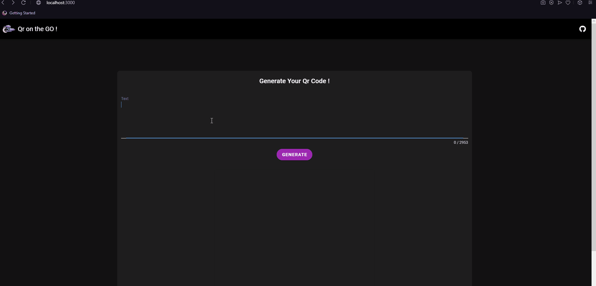

# Qr On The Go ✨

<div align="center">
A simple webapp that helps you generate Qr codes for your links/Texts and download'em 🔽
</div>

# Made using :

<div align="center">
    
    
    <h6><strong>Google Charts api</strong></h6>
    <a href="https://github.com/eligrey/FileSaver.js">FileSaver.JS</a>
</div>

# Demo :

<div align="center">
    
</div>

# Limitations :

<p>It can only generate codes if the length of the provided text doesn't exceed 2953 characters .</p>

## Customization

<p> 
You can change the image(displayed) size and the QR code size by tweaking the height and width values  :

```html
<v-img class="white--text" height="500px" width="500px" :src="Qr"> </v-img>
```

```js
Api :'https://chart.googleapis.com/chart?cht=qr&chs=500x500&chl=',

```

</p>

## Build Setup

```bash
# install dependencies
$ npm install

# serve with hot reload at localhost:3000
$ npm run dev

# build for production and launch server
$ npm run build
$ npm run start

# generate static project
$ npm run generate
```

# Contact

<div align="center">
<p>you can contact me at ZTF666@protonmail.ch or via my portfolio</p>

</div>

<div align="center">

<table>
  <tr>
    <td align="center"><a href="https://ztfportfolio.web.app/" target='_blank'><br /><sub><b>ZTF666</b></sub></a></td>
  </tr>
</table>

</div>

## License

<div align="center">

**:alien: Qr On The Go 👽**
released under the [MIT](LICENSE) License.
<br><br>

<strong><p>Made with 🖤 by ZTF - N.EA | 2021 </p> </strong>

</div>
